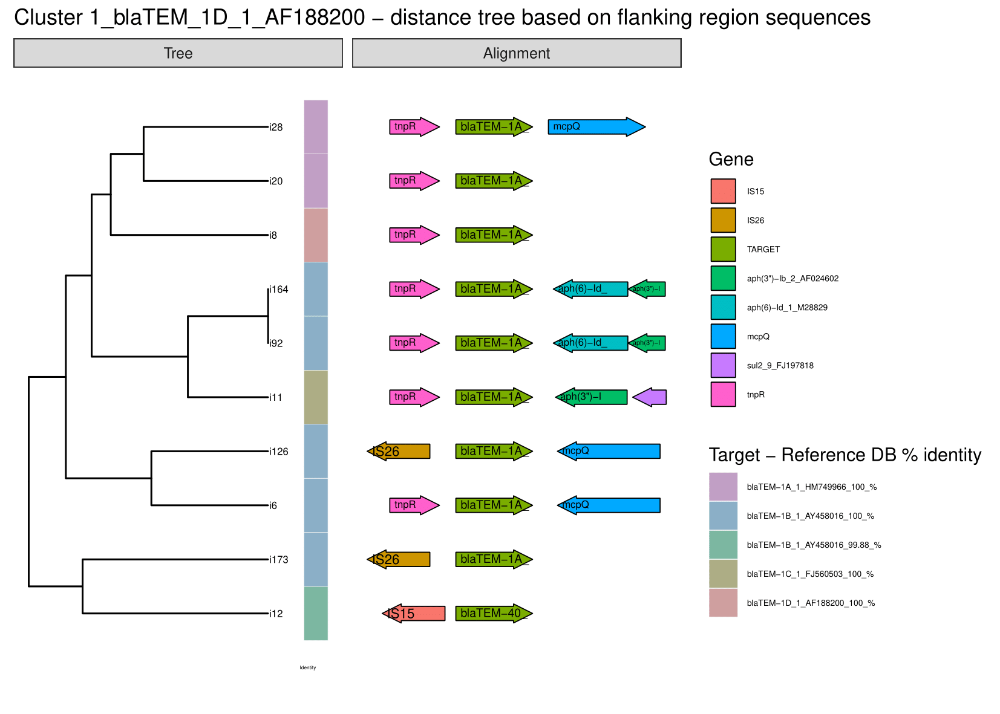

# FLANKOPHILE
FLANKOPHILE version 0.1.4
By Alex Vincent Thorn


## About Flankophile

Flankophile is a pipeline build for easy analysis and visualization of gene synteny - the genetic context of genes. Flankophile is especially usefull for comparing the flanking regions of specific genes or other target sequences across different samples. 

**Input:** Assembled genetic data in fasta format plus a reference database containing target sequences in fasta format.

**Output:** [Gene synteny plots](example_output/5_plots), [results tables](example_output/2_filter/), [distance matrices](example_output/4_cluster_results/0_blaSHV-187/0_blaSHV-187.flanks_with_gene_dist), genetic sequences of genes and flanking regions in fasta format. 





## How to run Flankophile

### [Computerome user? - quick guide for running Flankophile](quick_start.md)


### Prerequisites

Clone this repository to your computer.

```bash
git clone https://avthorn@bitbucket.org/genomicepidemiology/flankophile.git

```

Flankophile is a Snakemake based pipeline. Snakemake is a python based workflow management system.
The [Snakefile](Snakefile) contains the main pipeline code.


You need to Miniconda and Snakemake to run Flankophile. Flankophile is conda based and uses a conda env. You can see it in the file [environment.yaml](environment.yaml).
 You do not need to load the conda enviroment manually. Snakemake will automatically download the necessary conda packages when running the pipeline for the first time. For this reason, the pipeline will take a longer time to run the first time.

### Input files

In order to use the pipeline you need to prepare two input files: The reference database and the data you want to analyse.
 
The path to the input files must be given in the config file [config.yaml](config.yaml).


#### Reference database

The reference database contains reference sequences of all the genes or target sequences that you want to perform gene synteny analysis on. It has to be a DNA multi fasta file with unique headers. If the headers contain whitespace Flankophile will only consider characters before the whitespace. Special characters used in the [official version of the ResFinder database](https://bitbucket.org/genomicepidemiology/resfinder_db/src/master/) are allowed in headers. The reference database can contain from one to thousands of sequences. The reference database can contain reference genes or sequences that are not homologs. Flankophile will cluster the reference sequences by percentage identity and report the results separately for each cluster.


The [ResFinder database](input/example_input_files/ResFinder_08_02_2022.fa) is included in Flankophile as an example of a reference database. The ResFinder database consists of acquired antimicrobial resistance genes. The version found in this repository is from February 8 2022. The up-to-date ResFinder database is found [here](https://bitbucket.org/genomicepidemiology/resfinder_db/src/master/). If you want to use the included version of the ResFinder database for your analysis then you do not need to change the database variable in the contig file.


#### Sample input list

Your sample input data must consist of a number of assemblies, binned or unbinned contigs or genomes in DNA multifasta format. One multifasta per sample. You can input as many samples as wanted. 

The input_list file is a tsv file with two columns. Each row represents a sample. The first column is a unique nickname for each input fasta, for example, "sample_1" or "e.coli_bin_32". The name must not contain whitespace or slash but underscore, dot and dash is fine. The second column is the full path to the fasta file, including the file name. The columns must be separated by tab. Flankophile will ignore rows that start with **#**. This is useful if you want to add human-readable headers.
In [input_list_example_assembly_mode.tsv](input/example_input_files/input_list_example_assembly_mode.tsv) you can see an example of an input_list file. 

| #assembly_name | path                                   |
|----------------|----------------------------------------|
| dog_sample_1   | home/data/dog_v1.fasta                 |
| dog_sample_2   | home/data/dog_v2.fasta                 |
| pig_sample     | home/data/pig_sample.fsa               |
| cat_sample     | home/data/old/cat_ER34793_sample.fasta |


### Configuration file

Fill out [config.yaml](config.yaml) before running the pipeline. The path to input files can be given as relative path to the location of the Snakefile.
The configuation file contains numbered sections. Each number refer to an output folder.


| **Variable name**                   | **Suggestion**        | **Variable**    | **Notes**                                                                                          |
|-------------------------------------|-----------------------|-----------------|----------------------------------------------------------------------------------------------------|
| database                            | "input/db.fa"         | Path to file.   | Step 1. Multifasta file of genes of interest, DNA.                                                 |
| input_list                          | "input/sa.tsv"        | Path to file.   | Step 1. tsv file.                                                                                  |
| flank_length_upstreams              | "3000"                | Length in bp.   | Step 2.                                                                                            |
| flank_length_downstreams            | "3000"                | Length in bp.   | Step 2.                                                                                            |
| min_coverage_abricate               | "95"                  | In %.           | Step 2.                                                                                            |
| min_identity_abricate               | "95"                  | In %.           | Step 2.                                                                                            |
| cluster_identity_cd_hit             | "0.95"                | 1 equals 100 %. | Step 3.     github.com/weizhongli/cdhit/wiki/3.-User's-Guide#CDHITEST                              |
| cluster_wordsize_cd_hit             | "9"                   |                 | Step 3.     github.com/weizhongli/cdhit/wiki/3.-User's-Guide#CDHITEST                              |
| cluster_length_dif_cd_hit           | "0.9"                 |                 | Step 3.     github.com/weizhongli/cdhit/wiki/3.-User's-Guide#CDHITEST                              |
| Kmersize_kma                        | "16"                  | Kmer size.      | Step 4. For kma index.                                                                             |
| distance_measure                    | "1"                   | Distmatrix      | Step 4.- 1 k-mer hamming distance 64 Jaccard distance 256 Cosine distance 4096 Chi-square distance |


### Running the pipeline

Enter the flankophile folder.

Make sure you have the prerequisites.

Run the pipeline: 
`snakemake --use-conda --cores 39` 

Cores is the number of cores available. For more info on flags visit: 
https://snakemake.readthedocs.io/en/stable/executing/cli.html#command-line-interface 


#### Rerunning the pipeline
Flankophile creates the output directories in the order of the numbers. The files in the first directory are used to produce the files in the second directory, and so on. This is useful since it is then easy to rerun the analysis with different parameters without having to redo the whole analysis.

If you want to rerun the pipeline with new config settings, you must look in the config file [config.yaml](config.yaml)
 and take note of the numbered sections. If you want to change parameters you must delete all output
 with a number equal to or higher than the number of the section. You simply delete output in descending order starting with 99 and down to where you do not want to rerun anymore. Snakemake will rerun these parts of the pipeline with the new config settings when you give the run command `snakemake --use-conda --cores 39` again. 

Be aware that the step that produces the folder 1_search  is not deterministic, so if you delete this folder and rerun the pipeline, you may not get exactly the same results again. If you want to add more data or use a different reference database, you must delete the entire output folder. 


#### Redirect where to store conda packages
As a default conda will download the packages needed to your root directory.
If you want conda to store your packages and enviroments in another location than your root directoty then you can write this in the file called ".condarc". It may be in your root directory. If you do not have the file ".condarc" then you can make one and place it in your root and conda will find it.

```bash
auto_activate_base: false

pkgs_dirs:
    - /SOMEPATH_YOU_CHOOSE/.conda/pkgs

envs_dirs:
    - /SOMEPATH_YOU_CHOOSE/.conda/envs

```


## Output


**1_search**

This directory can be deleted if you are entirely done with the analysis, but keep it if you may want to rerun the data with different parameters, as this will save time.

**2_filter**

In this directory abricate results from all the samples have been merged. It contains 2 reports and 3 tsv files.
In step 1 no filtering has taken place yet. The raw collective abricate results can be found in [1_abricate_all.tsv](example_output/2_filter/1_abricate_all.tsv).
In step 2 the results have been filtered on the minimum coverage and minimum sequence identity chosen in the config file. See [2_abricate_filter_qual.tsv](example_output/2_filter/2_abricate_filter_qual.tsv). 
[2_abricate_filter_qual.report](example_output/2_filter/2_abricate_filter_qual.report) contains information on how many gene observtions that were discarded during filtering.

In step 3 the [tsv](example_output/2_filter/2_abricate_filter_qual.tsv) from step 2 has been filtered on flank length. Gene observations that are so close to the
 edge of a contig that there is not space for the full desired flank length are discarded. 
 [3_abricate_filter_length.report](example_output/2_filter/3_abricate_filter_length.report) contains information on how many gene observtions that were discarded during filtering.
 [3_final_gene_results.tsv](example_output/2_filter/3_final_gene_results.tsv) contains all the gene observations that are included in the further analysis.
 

**3_define_clusters**

cd_hit.clstr contains the results of clustering the reference genes used as templates by identity.

  
**4_cluster_results**

Contains one directory for each reference gene cluster. Directory names have two parts. The first part is a unique number. 
The second part after the underscore is the first part of the name of the gene that seeded the cluster. 
See [example of output from an induvidual gene family cluster](example_output/4_cluster_results/0_blaSHV-187/). The folder contains [distance matrices](example_output/4_cluster_results/0_blaSHV-187/0_blaSHV-187.flanks_with_gene_dist), cluster results as tsv, fasta files and output from Prokka.

| **Nickname**     | **Explanation**                                                                      |
|------------------|--------------------------------------------------------------------------------------|
| flanks_with_gene | The DNA sequence of target sequence and upstreams and downstreams flanking regions.  |
| just_gene        | The DNA sequence of target sequence only.                                            |
| masked_gene      | The DNA sequence of the flanking regions. Target sequence is included but masked.    |


**5_plots**

Contains all the plots produced by Flankophile from the R script [plot_gene_clusters_from_flankophile.R](bin/plot_gene_clusters_from_flankophile.R). Plots are made for each cluster in 4_cluster_results. The distance matrices are used to produce distance trees and the gene annotation is then plotted with the tree. 

[Examples of plots made with the pipeline](example_output/5_plots).


## Visualization

Flankophile automaticly output plots for each cluster from the results produced by the pipeline, but it is possible to visualize more metadata along with the plot. You can create your own custom plot, perhaps based on [this script](bin/plot_gene_clusters_stand_alone_version.R). Use the same versions of the packages as in this [script](bin/plot_gene_clusters_from_flankophile.R) Modify the script to read in a metadata table, join it with the cluster_results table and make an info table that can be read by the heatmap function. Here is an [example of plot made with a custom R script](example_output/5_plots/plot_made_with_custom_made_R_script_for_inspiration.pdf) which includes metadata on species. 

 Read more about tree visualization [here](https://yulab-smu.top/treedata-book/chapter7.html). 


## Contact
Alex Vincent Thorn

alvit@food.dtu.dk


## Supervisors

Head Supervisor Frank Møller Aarestrup.

Supervisor Patrick Munk.


## Tools used in the pipeline


**Abricate**

By Torsten Seemann.

[https://github.com/tseemann/abricate](https://github.com/tseemann/abricate)


**any2fasta**

By Torsten Seemann.

[github.com/tseemann/any2fasta](https://github.com/tseemann/any2fasta)


**bedtools**

[Bedtools documentation](https://bedtools.readthedocs.io/en/latest/)


**blast**

[blast.ncbi.nlm.nih.gov/Blast.cgi](https://blast.ncbi.nlm.nih.gov/Blast.cgi)


**cd-hit**

[weizhong-lab.ucsd.edu/cd-hit/](http://weizhong-lab.ucsd.edu/cd-hit/)

[cd-hit.org](http://cd-hit.org)

[CD-HIT: accelerated for clustering the next-generation sequencing data](https://www.ncbi.nlm.nih.gov/pmc/articles/PMC3516142/)


**clstr2txt.pl**

[https://raw.githubusercontent.com/weizhongli/cdhit/master/clstr2txt.pl](https://raw.githubusercontent.com/weizhongli/cdhit/master/clstr2txt.pl)


**KMA**

By Philip T.L.C. Clausen.
  
[https://bitbucket.org/genomicepidemiology/kma/src/master/](https://bitbucket.org/genomicepidemiology/kma/src/master/)

[Rapid and precise alignment of raw reads against redundant databases with KMA](https://pubmed.ncbi.nlm.nih.gov/30157759/)
 
Philip T.L.C. Clausen, Frank M. Aarestrup & Ole Lund, "Rapid and precise alignment of raw reads against redundant databases with KMA", BMC Bioinformatics, 2018;19:307. 
 


**Prokka**

By Torsten Seemann.

[https://github.com/tseemann/prokka](https://github.com/tseemann/prokka)

Seemann T. 
[Prokka: rapid prokaryotic genome annotation](https://academic.oup.com/bioinformatics/article/30/14/2068/2390517) 
Bioinformatics 2014 Jul 15;30(14):2068-9. [PMID:24642063](https://pubmed.ncbi.nlm.nih.gov/24642063/)


**R packages**

R base - 4.1.3

Tidyverse - 1.3.2

ggtree - 3.2.0

gggenes - 0.4.1

treeio - 1.18.0

ape - 5.6

ggnewscale - 0.4.7


**seqkit**

[bioinf.shenwei.me/seqkit/](https://bioinf.shenwei.me/seqkit/)


**Snakemake**

[Snakemake docs](https://snakemake.readthedocs.io/en/stable/)

[Sustainable data analysis with Snakemake](https://www.ncbi.nlm.nih.gov/pmc/articles/PMC8114187/)


## License

Copyright (c) 2022, Alex Vincent Thorn, Technical University of Denmark All rights reserved.

Licensed under the Apache License, Version 2.0 (the "License"); you may not use this file except in compliance with the License. You may obtain a copy of the License at
```
http://www.apache.org/licenses/LICENSE-2.0
```

Unless required by applicable law or agreed to in writing, software distributed under the License is distributed on an "AS IS" BASIS, WITHOUT WARRANTIES OR CONDITIONS OF ANY KIND, either express or implied. See the License for the specific language governing permissions and limitations under the License.
