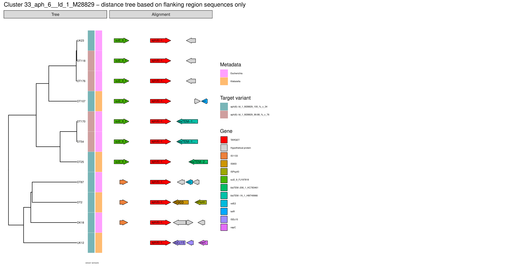

# FLANKOPHILE
FLANKOPHILE version 0.2.2
By Alex Vincent Thorn


## About Flankophile

Flankophile is a pipeline built for easy analysis and visualization of gene synteny - the genetic context of genes. Flankophile is especially useful for comparing the flanking regions of specific genes or other target sequences across different samples. Flankophile automaticly gene synteny plots in pdf format. Flankophile also outputs the percentage identity of each hit relative to its reference sequence. This allows for incorporating gene variants into the analysis.





## Output


[**1_hits_all.tsv**](example_output/1_hits_all.tsv)

The table [1_hits_all.tsv](example_output/1_hits_all.tsv) contains the data for all hits found by Abricate, which have the requested minimum percentage identity and minimum percentage coverage.

[**1_variants.fasta**](example_output/1_variants.fasta)

[1_variants.fasta](example_output/1_variants.fasta) contains the actual sequences for all the hits found in [1_hits_all.tsv](example_output/1_hits_all.tsv).


[**2_hits_included_in_flank_analysis.tsv**](example_output/2_hits_included_in_flank_analysis.tsv)

The tsv file [2_hits_included_in_flank_analysis.tsv](example_output/2_hits_included_in_flank_analysis.tsv) is a filtered version of [all_hits.tsv](example_output/1_hits_all.tsv) from step 1. [2_hits_included_in_flank_analysis.tsv](example_output/2_hits_included_in_flank_analysis.tsv) contains only hits that had space on their contig for the user-requested upstream and downstream flanking region. The rest of the analysis is based on these hits.

[**2_report_flank_filtering.txt**](example_output/2_report_flank_filtering.txt)

Flankophile outputs  [2_report_flank_filtering.txt](example_output/2_report_flank_filtering.txt) which informs the user on how many hits were discarded due to insufficient flanking region length. 


[**3_clustering.tsv**](example_output/3_clustering.tsv)

[3_clustering.tsv](example_output/3_clustering.tsv) is a table that contains information on which hits that belong to each output cluster, based on their reference sequences. The clustering is based on percentage identity.  

  
[**4_cluster_results**](example_output/4_cluster_results/33_aph_6__Id_1_M28829/)

The output contains one directory for each reference gene cluster. Directory names have two parts. The first part is a unique number. 
The second part after the underscore is the first part of the name of the gene that seeded the cluster. 
See [example of output from an induvidual gene family cluster](example_output/4_cluster_results/33_aph_6__Id_1_M28829/). The folder contains [distance matrices](example_output/4_cluster_results/33_aph_6__Id_1_M28829/33_aph_6__Id_1_M28829.target_and_flanking_regions_dist), [cluster results table](example_output/4_cluster_results/33_aph_6__Id_1_M28829/33_aph_6__Id_1_M28829.tsv), fasta files and output from Prokka.


[**4_plots**](example_output/4_plots)

All the plots produced by Flankophile from the R script [plot_gene_clusters_from_flankophile.R](bin/plot_gene_clusters_from_flankophile.R) are made in step 4. Plots are made for each cluster in 4_cluster_results. The distance matrices are used to produce distance trees and the gene annotation is then plotted with the tree. 

If the cluster contain more than 1 hit Flankophile will produce 3 plots based on 3 different distance trees. One [plot based on target sequence only](example_output/4_plots/33_aph_6__Id_1_M28829_target_sequence_only.pdf), one [plot based on flanking region sequence only](example_output/4_plots/33_aph_6__Id_1_M28829_flanking_regions_only.pdf) and one [plot based on both target sequence and flanking regions](example_output/4_plots/33_aph_6__Id_1_M28829_target_and_flanking_regions.pdf). The example plots are made from an [input_list](input/example_input_files/input_list_example_metadata.tsv) with metadata on species.For clusters where only one hit is found a single plot is outputted which shows just the gene synteny.


#### Output columns for tsv files

| **Column**     | **Example**                  | **Explanation**                                               |
|----------------|------------------------------|---------------------------------------------------------------|
| #FILE          | /home/assemblies/dog_1.fasta | Full path to fasta.                                           |
| SEQUENCE       | contig_27                    | Fasta header of contig where hit was found.                   |
| START          | 4032                         | Start position of hit on contig.                              |
| END            | 5526                         | End position of hit on contig.                                |
| STRAND         | +                            | Positive or negative sense of DNA sequence for hit.           |
| GENE           | blaTEM                       | Name of the reference sequence that matched hit.              |
| COVERAGE       | 1-1501/1501                  | What proportion of the reference sequence is in our sequence. |
| COVERAGE_MAP   | ========/======              | Visual represenation of the hit.                              |
| GAPS           | 1/4                          | Openings / gaps in query and subject.                         |
| %COVERAGE      | 99.33                        | Proportion of reference sequence covered in percentage.       |
| %IDENTITY      | 98.56                        | Proportion of exact nucleotide matches in percentage.         |
| CONTIG_LENGTH  | 12498                        | Length of contig where hit was found.                         |
| METADATA       | Denmark                      | Metadata from the input_list if metadata was provided.        |
| ASSEMBLY_NAME  | 1_Dog_sample                 | Assembly name from input_list. Unique for each fasta.         |
| OBSERVATION_ID | i_44                         | Unique identifier for each hit.                               |
| VARIANT        | v_11                         | Unique identifier for each unique sequence found among hits.  |

## Input

In order to use the pipeline you need to prepare two input files: The reference database and the input list of data you want to analyse.
 
The path to the input files must be given in the config file [config.yaml](config.yaml).


### Reference database

The reference database contains reference sequences of all the genes or target sequences that you want to perform gene synteny analysis on. It has to be a DNA multi fasta file with unique headers. Only AGCT is allowed in the sequence. Fasta headers may contain letters, numbers, dash, dot, underscore, parentheses, colon, forward slash, plus symbol, the pipe symbol '|' and ' - single quotation mark . Headers must start > followed by a number or a letter. If the headers contain whitespace Flankophile will only consider characters after whitespace as a comment. Headers must not be longer than 60 characters long. The headers as well as the sequences must be unique. You can use [DupRemover](https://github.com/abhijeetsingh1704/DupRemover) to test that sequences are unique. The reference database can contain from one to thousands of sequences. The reference database can contain reference genes or sequences that are not homologs. Flankophile will cluster the reference sequences by percentage identity and report the results separately for each cluster.


The [**ResFinder database**](input/example_input_files/ResFinder_08_02_2022.fa) is included in Flankophile as an example of a reference database. The ResFinder database consists of acquired antimicrobial resistance genes. The version found in this repository is from February 8 2022. The up-to-date ResFinder database is found [here](https://bitbucket.org/genomicepidemiology/resfinder_db/src/master/). If you want to use the included version of the ResFinder database for your analysis then you do not need to change the database variable in the contig file.


### Input list

Your sample input data must consist of a number of assemblies, binned or unbinned contigs, genomes or other data in DNA multifasta format. One multifasta per sample. You can input as many samples as wanted. 

The input_list file is a tsv file with 2 or 3 columns. Each row represents a sample. Flankophile will ignore rows that start with **#**. This is useful if you want to add headers.

**Column 1 - Assembly_name**
The first column is a unique nickname for each input fasta, for example, "sample_1" or "e.coli_bin_32". It is used to distinguish different samples. The name must not contain whitespace or slash. Letters, numbers, underscore, dot and dash is accepted. Column 1 is mandatory.
A useful feature is that if the first one or two characters in the assembly name are  letters, these will be included in the OBSERVATION_ID, which is printed in the plots as tip labels. If you are working with samples from different countries, it will make sense to make the countries' two-letter code the first two letters of the assembly names. If the assembly name does not start with a letter then the OBSERVATION_ID will start with a lowercase i.

**Column 2 - Path to fasta**
The second column is the full path to the fasta file, including the file name. The columns must be separated by tab. Column 2 is mandatory. 


**Column 3**
Column 3 is optional. Column 3 is a metadata column and Flankophile will automaticly recognise if it is present. You cannot add more than one metadata collumn. The metadata column must only contain numbers, letters and underscore. The metadata will be included in the output tables and in the plots. Examples of metadata could be host animal, sample site or gender. It is possible but not recomended to use more than 8 unique metadata values as it will be difficult to distinguish more than 8 different colors on the plots.


[**Input_list with 2 columns**](input/example_input_files/input_list_example.tsv) 


| #assembly_name | path                                   |
|----------------|----------------------------------------|
| dog_sample_1   | home/data/dog_v1.fasta                 |
| dog_sample_2   | home/data/dog_v2.fasta                 |
| pig_sample     | home/data/pig_sample.fsa               |
| cat_sample     | home/data/old/cat_ER34793_sample.fasta |


[**Input_list with 3 columns**](input/example_input_files/input_list_example_metadata.tsv)


| #assembly_name | path                                   | metadata |
|----------------|----------------------------------------|----------|
| dog_sample_1   | home/data/dog_v1.fasta                 | Dog      |
| dog_sample_2   | home/data/dog_v2.fasta                 | Dog      |
| pig_sample     | home/data/pig_sample.fsa               | Pig      |
| cat_sample     | home/data/old/cat_ER34793_sample.fasta | Cat      |


## How to run Flankophile

### [Computerome user? - Read quick guide for running Flankophile](quick_start.md)


### Prerequisites

Clone this repository to your computer.

```bash
git clone https://avthorn@bitbucket.org/genomicepidemiology/flankophile.git

```

Flankophile is a Snakemake based pipeline. Snakemake is a python based workflow management system.
The [Snakefile](Snakefile) contains the main pipeline code.


You need Miniconda (miniconda3/4.11.0) and [Snakemake](https://snakemake.readthedocs.io/en/stable/index.html) (snakemake/6.9.1) to run Flankophile. Flankophile is conda based and uses a conda env. You can see it in the file [environment.yaml](environment.yaml).
 You do not need to load the conda enviroment manually. Snakemake will automatically download the necessary conda packages when running the pipeline for the first time. For this reason, the pipeline will take a longer time to run the first time.


### Configuration file

Fill out [config.yaml](config.yaml) before running the pipeline. The path to input files can be given as a relative path to the location of the Snakefile.
The configuration file contains numbered sections. Each number refers to an output folder. Settings in step 1 affect all folders, and step 2 affects all output from 2 and up. And so on.


| **Variable name**                   | **Suggestion**        | **Variable**    | **Notes**                                                                                          |
|-------------------------------------|-----------------------|-----------------|----------------------------------------------------------------------------------------------------|
| database                            | "input/db.fa"         | Path to file.   | Step 1. Multifasta file of genes of interest, DNA.                                                 |
| input_list                          | "input/sa.tsv"        | Path to file.   | Step 1. Tsv file.                                                                                  |
| min_coverage_abricate               | "98"                  | In %. 50 - 100% | Step 1. Minimum coverage in percentage compared to reference sequence.                             |
| min_identity_abricate               | "98"                  | In %. 50 - 100% | Step 1. Minimum percentage identity compared to reference sequence.                                |
| flank_length_upstreams              | "1500"                | Length in bp.   | Step 2.                                                                                            |
| flank_length_downstreams            | "1500"                | Length in bp.   | Step 2.                                                                                            |
| cluster_identity_and_length_diff    | "0.95"                | 1 equals 100 %. | Step 3. Interval: 0.80 - 1    CD-HIT-EST parameters c and s.                                       |
| k-mer_size                          | "16"                  | Kmer size.      | Step 4. For kma index. Minimum 6                                                                   |
| distance_measure                    | "1"                   | Distmatrix      | Step 4. Each number represents a methods. See distance methods.                                    |


**Distance methods:**
```bash
    1      k-mer hamming distance
   64      Jaccard distance
  256      Cosine distance
 4096      Chi-square distance
```


### Running the pipeline

Enter the flankophile folder.

Make sure you have the prerequisites.

Run the pipeline: 
`snakemake --use-conda --cores 39` 

Cores is the number of cores available. For more info on flags visit: 
https://snakemake.readthedocs.io/en/stable/executing/cli.html#command-line-interface 

You should run the pipeline with as much memory as possible if you have large input files. The search step uses a large amount of memory, and if too little memory is used, Abricate may not find all possible hits in very large files. If you want to make sure that the computer runs the pipeline with enough memory, then run the pipeline twice with the same config file and compare the files output/1_hits_all.tsv from each run using 

```bash
diff output1/1_hits_all.tsv output2/1_hits_all.tsv

``` 
If they are identical, that means that enough memory was used. 


#### Rerunning the pipeline
Flankophile creates the output in the order of the numbers. The first files are used to produce the files in the second directory, and so on. This is useful since it is then easy to rerun the analysis with different parameters without having to redo the whole analysis.

If you want to rerun the pipeline with new config settings, you must look in the config file [config.yaml](config.yaml)
 and take note of the numbered sections. If you want to change parameters, you must delete all output
 with a number equal to or higher than the number of the section. You simply delete output in descending order starting with 99 and down to where you do not want to rerun anymore. Snakemake will rerun these parts of the pipeline with the new config settings when you give the run command `snakemake --use-conda --cores 39` again. 
 
Step 1 is the most time-consuming step. If you want to rerun the pipeline with other parameters for steps 2-4 then you can save time by deleting the files for the other steps but keeping the files starting with 1.

You must delete the entire output folder if you want to rerun the pipeline from the start.


#### Redirect where to store conda packages
As a default conda will download the packages needed to your root directory.
If you want conda to store your packages and enviroments in another location than your root directoty then you can write this in the file called ".condarc". Maybe you already have a ".condarc" file in your root directory. If not you can just make one and place it in your root.
Write this in your ".condarc" file:

```bash
auto_activate_base: false

pkgs_dirs:
    - /SOMEPATH_YOU_CHOOSE/.conda/pkgs

envs_dirs:
    - /SOMEPATH_YOU_CHOOSE/.conda/envs

```


## Contact
Alex Vincent Thorn

alvit@food.dtu.dk

Twitter: @AlexVThorn


## Supervisors

Head Supervisor Frank Møller Aarestrup.

Supervisor Patrick Munk.


## Tools used in the pipeline


**Abricate**

By Torsten Seemann.

[https://github.com/tseemann/abricate](https://github.com/tseemann/abricate)


**any2fasta**

By Torsten Seemann.

[github.com/tseemann/any2fasta](https://github.com/tseemann/any2fasta)


**bedtools**

[Bedtools documentation](https://bedtools.readthedocs.io/en/latest/)


**blast**

[blast.ncbi.nlm.nih.gov/Blast.cgi](https://blast.ncbi.nlm.nih.gov/Blast.cgi)


**cd-hit**

[weizhong-lab.ucsd.edu/cd-hit/](http://weizhong-lab.ucsd.edu/cd-hit/)

[cd-hit.org](http://cd-hit.org)

[CD-HIT: accelerated for clustering the next-generation sequencing data](https://www.ncbi.nlm.nih.gov/pmc/articles/PMC3516142/)


**clstr2txt.pl**

[https://raw.githubusercontent.com/weizhongli/cdhit/master/clstr2txt.pl](https://raw.githubusercontent.com/weizhongli/cdhit/master/clstr2txt.pl)


**DupRemover.py**

https://github.com/abhijeetsingh1704/DupRemover

Singh, Abhijeet. 2020. DupRemover: A Simple Program to Remove Duplicate Sequences from Multi-Fasta File


**KMA**

By Philip T.L.C. Clausen.
  
[https://bitbucket.org/genomicepidemiology/kma/src/master/](https://bitbucket.org/genomicepidemiology/kma/src/master/)

[Rapid and precise alignment of raw reads against redundant databases with KMA](https://pubmed.ncbi.nlm.nih.gov/30157759/)
 
Philip T.L.C. Clausen, Frank M. Aarestrup & Ole Lund, "Rapid and precise alignment of raw reads against redundant databases with KMA", BMC Bioinformatics, 2018;19:307. 
 


**Prokka**

By Torsten Seemann.

[https://github.com/tseemann/prokka](https://github.com/tseemann/prokka)

Seemann T. 
[Prokka: rapid prokaryotic genome annotation](https://academic.oup.com/bioinformatics/article/30/14/2068/2390517) 
Bioinformatics 2014 Jul 15;30(14):2068-9. [PMID:24642063](https://pubmed.ncbi.nlm.nih.gov/24642063/)


**R packages**

R base - 4.1.3

Tidyverse - 1.3.2

ggtree - 3.2.0

gggenes - 0.4.1

treeio - 1.18.0

ape - 5.6

ggnewscale - 0.4.7


**seqkit**

[bioinf.shenwei.me/seqkit/](https://bioinf.shenwei.me/seqkit/)


**Snakemake**

[Snakemake docs](https://snakemake.readthedocs.io/en/stable/)

[Sustainable data analysis with Snakemake](https://www.ncbi.nlm.nih.gov/pmc/articles/PMC8114187/)


## License

Copyright (c) 2022, Alex Vincent Thorn, Technical University of Denmark All rights reserved.

Licensed under the Apache License, Version 2.0 (the "License"); you may not use this file except in compliance with the License. You may obtain a copy of the License at
```
http://www.apache.org/licenses/LICENSE-2.0
```

Unless required by applicable law or agreed to in writing, software distributed under the License is distributed on an "AS IS" BASIS, WITHOUT WARRANTIES OR CONDITIONS OF ANY KIND, either express or implied. See the License for the specific language governing permissions and limitations under the License.
