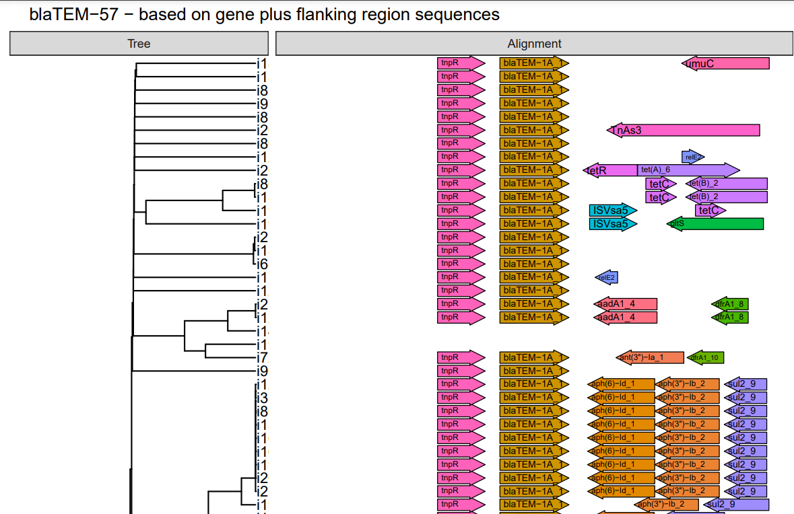

# FLANKOPHILE
FLANKOPHILE version 0.0.4
By Alex Vincent Thorn


## [Quick start - for Computerome users](quick_start.md)


## About Flankophile

Flankophile is a pipeline build for easy analysis of gene synthony - the genetic context of genes. Flankophile locates genes of interest in the input data and extracts the gene plus the upstream and downstream flanking regions.

Requied input: Assempled genetic data from multiple samples in fasta format plus a reference gene database in fasta format.

Output: Distance matrix, neighbor joining trees, genetic sequences of genes and flanking regions. 

The output can be visualized in RStudio with the R script [plot_gene_clusters_from_flankophile.R](R/plot_gene_clusters_from_flankophile.R).




## How to run Flankophile

Download this repository to your computer.

```bash
git clone https://avthorn@bitbucket.org/genomicepidemiology/flankophile.git

```

Flankophile is a Snakemake based pipeline. Snakemake is a python based workflow management system.
The [Snakefile](Snakefile) contains the main pipeline code.

### Prerequisites


You need to Miniconda and Snakemake to run Flankophile. Flankofile is conda based and uses a conda env. You can see it in the file environment.yaml.
 You do not need to load the conda enviroment manually. Snakemake will automatically download the necessary conda packages when running the pipeline for the first time. For this reason, the pipeline will take a longer time to run the first time.

### Input files

In order to use the pipeline you need to prepare two input files: The reference database and the data you want to analyse.
 
The path to the input files must be given in the config file [config.yaml](config.yaml).


#### Reference database

The reference database contains reference sequences of all the genes that you want to search for in your data. 
Flankophile will find these genes in your data and extract the gene sequence and the flanking sequences on each side of the gene.
The reference database can contain reference genes that are not homologs. Flankophile will cluster the reference genes by percentage identity and report the results separately for each cluster.
The reference database must be a multifasta file. The resfinder database is given as an example of a reference database.

It can be found here [Resfinder_08_02_2022_dub_rem.fa](input/example_input_files/Resfinder_08_02_2022_dub_rem.fa). The ResFinder database consists 
of acquired antimicrobial resistance genes. The version found in this repository is from February 8 2022. 
The uptodate ResFinder database is found [here](https://bitbucket.org/genomicepidemiology/resfinder_db/src/master/).


#### Sample input list

Your sample input data must consist of a number of assemblies or genomes in DNA multifasta format. One multifasta per sample. You can input as many samples as wanted. You have to use one of two input file formats: assembly input file or contig input file. Instead of entire assemblies you can also use induvidual bins from a binned assembly and use those induvidual bins as "assemblies". It does not matter, any collection of contigs in a multifasta file will work.

The pipeline will ignore lines that start with **#**. This is useful if you want to add human-readable headers between different datasets in the file.


**Assembly/bin level analysis**

The recommended way is to use assembly-level analysis. This is when you want to analyse the entire assembly/bin and not analyse only a subset of the contigs in the multifasta.  The input file is a tsv file with two columns. The first column has to be a unique name for each input fasta, for example, "sample_1" or "e.coli_bin_32". The name must not contain whitespace.

The second column is the full path to the fasta file, including the file name. 
In [test_input_assemblies_list_small.tsv](input/example_input_files/test_input_assemblies_list_small.tsv) you can see an example of an assembly level input file. 

| #assembly_name | path                                   |
|----------------|----------------------------------------|
| dog_sample_1   | home/data/dog_v1.fasta                 |
| dog_sample_2   | home/data/dog_v2.fasta                 |
| pig_sample     | home/data/pig_sample.fsa               |
| cat_sample     | home/data/old/cat_ER34793_sample.fasta |


**Config level analysis**

You can use this type op input files if you are only interested in a specific contigs from each multifasta. This may be relavant if for example you have used a tool to analyse which contigs in a assembly/bin that are from plasmids and now you only want to run flankophile on those contigs.

The format is a tsv file with three columns. One line per contig. The first column contains a unique nickname for the input fasta. The name must not contain whitespace and is has to be unique for each different fasta path. The third column is the full path to the fasta.  The second column is the name of the contig. The name of the contig is the fasta header without the **>**. This has to be unique within each fasta and must not contain whitespace. In this file there is one line per contig. Since you are propably the interested in many contigs from each fasta the values in column 1 and 3 will be identical for many lines, while the second one will be different. 

 It has to be a unique for each input fasta, but contigs from the same assembly/bin will have the same name in collumn 1. The second column is the name of the contig. This has to be unique for each input fasta.  
In [test_input_contig_list_small.tsv](input/example_input_files/test_input_contig_list_small.tsv) you can see an example of a contig level input file. 

| #assembly_name | contig_name  | path                                   |
|----------------|--------------|----------------------------------------|
| dog_sample_1   | contig_27    | home/data/dog_v1.fasta                 |
| dog_sample_1   | contig_35    | home/data/dog_v1.fasta                 |
| dog_sample_2   | c_45         | home/data/dog_v2.fasta                 |
| dog_sample_2   | c_66         | home/data/dog_v2.fasta                 |
| dog_sample_2   | c_89         | home/data/dog_v2.fasta                 |
| pig_sample     | contig_44    | home/data/pig_sample.fsa               |
| cat_sample     | Contig_10003 | home/data/old/cat_ER34793_sample.fasta |
| cat_sample     | Contig_10009 | home/data/old/cat_ER34793_sample.fasta |


### Configuration file

Fill out [config.yaml](config.yaml) before running the pipeline. The path to input files can be given as relative path to the location of the Snakefile.
The configuation file contains numbered sections. Each number refer to an output folder.


| **Variable name**                   | **Suggestion**        | **Variable**    | **Notes**                                                                                          |
|-------------------------------------|-----------------------|-----------------|----------------------------------------------------------------------------------------------------|
| database                            | "input/db.fa"         | Path to file.   | Step 0. Multifasta file of genes of interest, DNA.                                                 |
| input_format                        | "assemblies"          | Format.         | Step 1.                                                                                            |
| input_list                          | "input/sa.tsv"        | Path to file.   | Step 1. tsv file.                                                                                  |
| flank_length_upstreams              | "3000"                | Length in bp.   | Step 2.                                                                                            |
| flank_length_downstreams            | "3000"                | Length in bp.   | Step 2.                                                                                            |
| min_coverage_abricate               | "95"                  | In %.           | Step 2.                                                                                            |
| min_identity_abricate               | "95"                  | In %.           | Step 2.                                                                                            |
| cluster_identity_cd_hit             | "0.95"                | 1 equals 100 %. | Step 5.     github.com/weizhongli/cdhit/wiki/3.-User's-Guide#CDHITEST                              |
| cluster_wordsize_cd_hit             | "9"                   |                 | Step 5.     github.com/weizhongli/cdhit/wiki/3.-User's-Guide#CDHITEST                              |
| cluster_length_dif_cd_hit           | "0.9"                 |                 | Step 5.     github.com/weizhongli/cdhit/wiki/3.-User's-Guide#CDHITEST                              |
| Kmersize_kma                        | "16"                  | Kmer size.      | Step 5. For kma index.                                                                             |
| distance_measure                    | "1"                   | Distmatrix      | Step 5.- 1 k-mer hamming distance 64 Jaccard distance 256 Cosine distance 4096 Chi-square distance |


### Running the pipeline

Enter the flankophile folder.

Run the pipeline: 
`snakemake --use-conda --cores 39` 

Cores is the number of cores available. For more info on flags visit: 
https://snakemake.readthedocs.io/en/stable/executing/cli.html#command-line-interface To add more samples. Delete folders and files numbered 2 and up.


#### Running only part of the pipeline

If your dataset is very large you may want to run the pipeline in 3 stages. That way you may avoid
spending compute time rerunning the later stages again and again while you parametrize the first stages.
In the Snakefile around line 30 you find *rule all*. There are 4 files under the rule. 
The first and last file must always be included. 

If you write a # in front of "output/99_trees_and_distance_matrixes_done" 
then you do not run the last stage, step 5 of the pipeline. You can remove the # again later to run this step.
If you write a # in front of both
"output/4_cluster_by_gene_family/cd_hit.processed" and "output/99_trees_and_distance_matrixes_done"
 then you will only run the first stage, step 1 and 2 of the pipeline.

#### Rerunning the pipeline
If you want to rerun part of the pipeline you simply delete output folders and files and 
Snakemake will rerun these part of the pipeline when you give the run command `snakemake --use-conda --cores 39` again. 
You must delete output in descending order starting with 99 and down to where you do not want to rerun anymore. 
Be aware that the step that produces the folder 1_abricate  is not deterministic so if you delete this folder and rerun the pipeline you will not get exactly the same results.

If you want to rerun the pipeline with new config settings you must look in the config file [config.yaml](config.yaml)
 and take note of the numbered sections. If you want to change a parameters you must delete all output
 with a number equal or higher than the number of the section. 

If you want to add more data you must delete all output except 
0_setup_abricate_db and 1_abricate. You add more data by appending more lines to the
 input_list file. If you want to use a difference reference database you must delete the entire
 output directory and start over. 


## Output

The output directories are created by Flankophile in the order of the numbers. The files in the first directory are used to produced the files in the second directory and so on. This is usefull since it is then easy to run the analysis with different parameters without having to redo the whole analysis.


**1_abricate**

Contains one directory per input fasta. Can be deleted if one is done with the analysis.

**2_filter_gene_observations**

In this directory abricate results from all the samples have been merged. It contains 3 reports and 3 tsv files.
In step 1 no filtering has taken place yet. The raw collective abricate results can be found in 1_abricate_all.tsv.
In step 2 the results have been filtered on minimum coverage and minimum sequence identity. 
2_abricate_filter_qual.report contains information on how many gene observtions that were discarded during filtering.

In step 3 the tsv from step 2 has been filtered on flank length. Gene observations that are so close to the
 edge of a contig that there is not space for the full desired flank length are discarded. 
 3_abricate_filter_length.report contains information on how many gene observtions that were discarded during filtering.
 3_final_gene_results.tsv contains all the gene observations that are included in the further analysis.
 
 See **[example of output folder 2 for a full flankophile run](example_output/2_filter_gene_observations/)**.


**3_extract_sequences**

These files are just temperaty files and can be deleted by the user without loss of important data.

**4_cluster_by_gene_family**

cd_hit.clstr contains the results of clustering the reference genes used as templates by identity.
The rest of the contents of this folder can be deleted by the user without loss of important data.
  
**5_gene_clusters**

Contains one directory for each reference gene cluster. Directory names have two parts. The first part is a unique number. 
The second part after the underscore is the first part of the name of the gene that seeded the cluster. 
See **[example of output from an induvidual gene family cluster](example_output/5_gene_clusters/0_blaSHV-187/)**.

| **Nickname**     | **Explanation**                                                                      |
|------------------|--------------------------------------------------------------------------------------|
| flanks_with_gene | The DNA sequence of target gene and upstreams and downstreams flanking regions.      |
| just_gene        | The DNA sequence of target gene only.                                                |
| masked_gene      | The DNA sequence of flanks of target gene. Target genes is included but masked as N. |

## Visualization

The R script [plot_gene_clusters_from_flankophile.R](R/plot_gene_clusters_from_flankophile.R)
 can be used to visualize the results in output folder 5.
 It plots distance trees with gene annotation for a gene cluster. 
The trees are based on the distance matrices. See [distance matrix format](example_output/5_gene_clusters/0_blaSHV-187/0_blaSHV-187.flanks_with_gene_dist). 

The script can be run with RStudio and should be run with the R directory as the working directory. R version 4.1.2 was used for development. Certain packages will not work with all versions of R. Try 4.1.2 or 4.1.3.


**[Example of output](R/Demo_R_plot.pdf)**

## Contact
Alex Vincent Thorn

alvit@food.dtu.dk


## Supervisors

Head Supervisor Frank Møller Aarestrup.

Supervisor Patrick Munk.


## Tools used in the pipeline


**Abricate**

By Torsten Seemann.

[https://github.com/tseemann/abricate](https://github.com/tseemann/abricate)


**any2fasta**

By Torsten Seemann.

[github.com/tseemann/any2fasta](https://github.com/tseemann/any2fasta)


**bedtools**

[Bedtools documentation](https://bedtools.readthedocs.io/en/latest/)


**blast**

[blast.ncbi.nlm.nih.gov/Blast.cgi](https://blast.ncbi.nlm.nih.gov/Blast.cgi)


**cd-hit**

[weizhong-lab.ucsd.edu/cd-hit/](http://weizhong-lab.ucsd.edu/cd-hit/)

[cd-hit.org](http://cd-hit.org)

[CD-HIT: accelerated for clustering the next-generation sequencing data](https://www.ncbi.nlm.nih.gov/pmc/articles/PMC3516142/)


**clearcut**

[Clearcut: a fast implementation of relaxed neighbor joining](https://academic.oup.com/bioinformatics/article/22/22/2823/197536)


**clstr2txt.pl**

[https://raw.githubusercontent.com/weizhongli/cdhit/master/clstr2txt.pl](https://raw.githubusercontent.com/weizhongli/cdhit/master/clstr2txt.pl)


**KMA**

By Philip T.L.C. Clausen.
  
[https://bitbucket.org/genomicepidemiology/kma/src/master/](https://bitbucket.org/genomicepidemiology/kma/src/master/)

[Rapid and precise alignment of raw reads against redundant databases with KMA](https://pubmed.ncbi.nlm.nih.gov/30157759/)
 
Philip T.L.C. Clausen, Frank M. Aarestrup & Ole Lund, "Rapid and precise alignment of raw reads against redundant databases with KMA", BMC Bioinformatics, 2018;19:307. 
 


**prokka**

By Torsten Seemann.

[https://github.com/tseemann/prokka](https://github.com/tseemann/prokka)

Seemann T. 
[Prokka: rapid prokaryotic genome annotation](https://academic.oup.com/bioinformatics/article/30/14/2068/2390517) 
Bioinformatics 2014 Jul 15;30(14):2068-9. [PMID:24642063](https://pubmed.ncbi.nlm.nih.gov/24642063/)


**seqkit**

[bioinf.shenwei.me/seqkit/](https://bioinf.shenwei.me/seqkit/)


**Snakemake**

[Snakemake docs](https://snakemake.readthedocs.io/en/stable/)

[Sustainable data analysis with Snakemake](https://www.ncbi.nlm.nih.gov/pmc/articles/PMC8114187/)


## License

Copyright (c) 2022, Alex Vincent Thorn, Technical University of Denmark All rights reserved.

Licensed under the Apache License, Version 2.0 (the "License"); you may not use this file except in compliance with the License. You may obtain a copy of the License at
```
http://www.apache.org/licenses/LICENSE-2.0
```

Unless required by applicable law or agreed to in writing, software distributed under the License is distributed on an "AS IS" BASIS, WITHOUT WARRANTIES OR CONDITIONS OF ANY KIND, either express or implied. See the License for the specific language governing permissions and limitations under the License.
